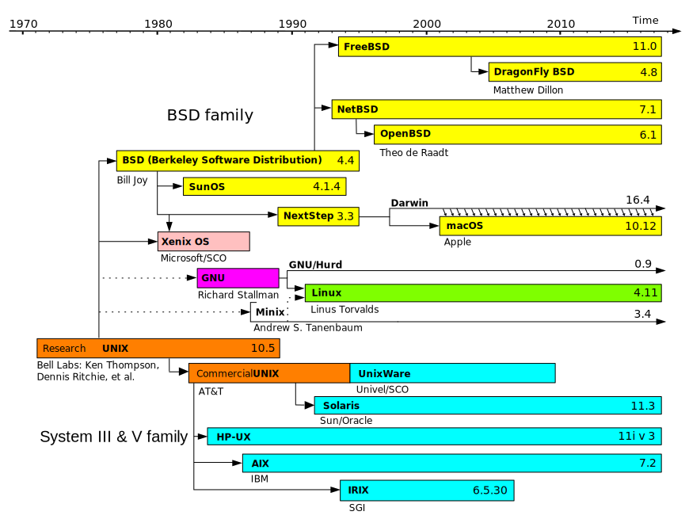
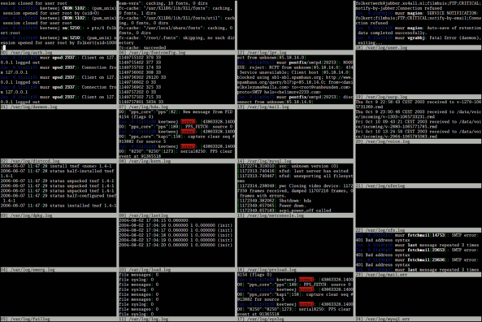

A guide for boosting your macOS shell experience.

---

## How Do You Call Your Workstation?

Give your box a name please: (⚠️ Change `rafi-mac` )

```bash
hostname
export COMPUTER_NAME="rafi-mac"
sudo scutil --set ComputerName "${COMPUTER_NAME}"
sudo scutil --set HostName "${COMPUTER_NAME}"
sudo scutil --set LocalHostName "${COMPUTER_NAME}"

sudo defaults write /Library/Preferences/SystemConfiguration/com.apple.smb.server NetBIOSName -string "${COMPUTER_NAME}"
```

You might need to reboot your laptop after this. 🙄

Check-out https://mths.be/macos for awesome ways to configure your macOS.

---

## Most Frequently Used Shells

1. **Bash** — (Bourne Again Shell) Default on many Linux distros.
2. **Tcsh** — Enhanced C shell.
3. **Ksh** — Korn shell.
4. **Zsh** — Incorporates many features of other Unix/GNU Linux shells.
5. **Fish** — Friendly interactive shell.

---

## Apple default shell is ZSH

Since around 2020, apple has switched to ZSH.

This tutorial will show-case both Bash and ZSH crafting.

Follow **ONLY** the parts that are relevant to your shell.

---

## Apple Packs Outdated Software

```bash
$ echo $BASH_VERSION
3.2.57(1)-release

$ git version
git version 2.17.1
```

These are old versions.

---

# Bash: Let's Install Latest Greatest!

Make sure first you uninstall a conflicting package,
if you have it installed.

```bash
brew uninstall --force bash-completion   # Don't worry if this fails.
brew install readline bash bash-completion@2
```

---

## Bash: Set As Default Shell

```bash
echo "/opt/homebrew/bin/bash" | sudo tee -a /etc/shells
chsh -s /opt/homebrew/bin/bash
```

Now, close all Terminal windows and open a new one.

```bash
echo $BASH_VERSION
```

You should see the fresh new Bash version you've installed.

---

## GNU vs. BSD

POSIX is a set of standards to implement.

GNU tools are basically open versions of tools that already existed but were
redone to conform to principals of open software.

Unix and BSD are "older" implementations of POSIX that are various levels of
"closed source".

macOS is a grandchild of BSD, and uses BSD tools.

---



---

## GNU vs. BSD

Let's install some GNU tools!

```bash
brew install coreutils gnutls gawk gnu-sed gnu-tar gnu-which
```

```bash
brew ls coreutils
/opt/homebrew/bin/gsort --help
/usr/bin/sort --help
```

Note the difference.

---

# Init Scripts

Remember `autoexec.bat` and `config.sys` ?

```dosbatch
@ECHO OFF
PROMPT $P$G
PATH C:\DOS;C:\WINDOWS
SET TEMP=C:\TEMP
SET BLASTER=A220 I7 D1 T2
LH SMARTDRV.EXE
LH DOSKEY
LH MOUSE.COM /Y
```

---

### User Init Scripts

- `~/.*profile` — set the environment for login shells.
- `~/.*rc` — set the environment for interactive shells.

| Bash             | ZSH            |
|------------------|----------------|
| `.bash_profile`  | `.zprofile`    |
| `.bashrc`        | `.zshrc`       |

---

### Bash Invocation

Bash behaviour can be altered depending on how it is invoked. If Bash is
spawned by login in a TTY, an SSH daemon, or similar, it is considered
a **login shell**. This mode can also be engaged using the `-l`/`--login`
option. Bash is considered an **interactive shell** when its standard input
and error are connected to a terminal, and it is not started with `-c` option.

All interactive shells source `~/.bashrc`, while interactive _login_ shells
also source `~/.bash_profile`. Your terminal emulator might be using
a _login_ shell via `-l`.

---

## Pop Quiz

Which shell files are sourced in each following example?

```bash
/bin/sh -c 'echo Hello'           # (1)
/bin/bash -l                      # (2)
/bin/zsh                          # (3)
ssh user@host                     # (4)

open -a VSCode.app                # (5)
open -a 'Visual Studio Code.app'  # (6)
```

---

## Bash: Fresh New Shell Init Scripts

Lets backup our .bashrc and .bash_profile and start a new fresh beginning.

```bash
cd ~
cp .bashrc .bashrc.old
cp .bash_profile .bash_profile.old
rm -f .bashrc .bash_profile

touch .bashrc .bash_profile .bash_aliases .bash_env .inputrc
```

---

## ZSH: Fresh New Shell Init Scripts

Lets backup our .zshrc and .zprofile and start a new fresh beginning.

```bash
cd ~
cp .zshrc .zshrc.old
cp .zprofile .zprofile.old
rm -f .zshrc .zprofile

touch .zshrc .zprofile .zaliases .zshenv .inputrc
```

---

## Let's Architect This

```bash
mkdir -p ~/.local/{share,state,bin} ~/.cache
```

In your new `~/.zshenv` or `~/.bash_env` append:

```bash
export LC_ALL="en_US.UTF-8"
export LANG="en_US.UTF-8"
export LANGUAGE="en_US.UTF-8"

# XDG directories
export XDG_CONFIG_HOME="$HOME/.config"
export  XDG_CACHE_HOME="$HOME/.cache"
export   XDG_DATA_HOME="$HOME/.local/share"
export  XDG_STATE_HOME="$HOME/.local/state"
```

(Change `en_US.UTF-8` to something else if needed)

---

## Bash: Let's Source 'em!

In your new `~/.bash_profile`:

```bash
source "$HOME/.bash_env"
source "$HOME/.bashrc"
```

And in your new `~/.bashrc`:

```bash
# Abort if not running interactively
[[ $- != *i* ]] && return

source "$HOME/.bash_aliases"
```

---

## ZSH: Let's Source 'em!

ZSH order of operations:

`.zshenv` → `.zprofile` → `.zshrc` → `.zlogin` → `.zlogout`

We only need to load `.zaliases` in our new `~/.zshrc`:

```bash
source "$HOME/.zaliases"
```

---

# Readline

> GNU Readline is a software library that provides line-editing and history
> capabilities for interactive programs with a command-line interface, such
> as Bash, Python, Ruby, GDB, SQLite, nftables, and many more.

---

## Readline Config

Update `~/.inputrc` with following:

```readline
$include /etc/inputrc

# Ring the bell, let other programs handle it (urxvt, tmux, etc.)
set bell-style audible

# Ignore case when matching and completing paths
set completion-ignore-case On

# Treat underscores and hyphens the same way for completion purposes
set completion-map-case On

# Show me up to 5,000 completion items, don't be shy
set completion-query-items 5000

# Don't display control characters like ^C if I input them
set echo-control-characters Off

# Expand tilde to full path on completion
set expand-tilde On

# Preserve caret position while browsing through history lines
set history-preserve-point On

# When completing directories, add a trailing slash
set mark-directories On

# Do the same for symlinked directories
set mark-symlinked-directories On

# on menu-complete, first display the common prefix, then cycle through the
# options when hitting TAB
set menu-complete-display-prefix On

# Don't paginate possible completions
set page-completions Off

# Show multiple completions on first tab press
set show-all-if-ambiguous On

# Don't re-complete already completed text in the middle of a word
set skip-completed-text On

# Show extra file information when completing, like `ls -F` does
set visible-stats on

# Color files by types
# Note that this may cause completion text blink in some terminals, e.g. xterm
set colored-stats on

# Color the common prefix
set colored-completion-prefix On
```

---

## Tell Shell Where to Find Things

Append to `~/.zshenv` or `~/.bash_env`

```bash
# Local bin first, then PATH, and lastly the relative bin/ directory.
export PATH="$HOME/.local/bin:$PATH:bin"

export HOMEBREW_PREFIX="${HOMEBREW_PREFIX:-/opt/homebrew}"

export HOMEBREW_GITHUB_API_TOKEN=""       # Your token here

# Misc defaults
export LESS="-FiQMXR"
export LESSCHARSET="UTF-8"
export VISUAL=vim
export EDITOR="$VISUAL"
export PAGER=less
```

ℹ️ Generate new token for Homebrew at https://github.com/settings/tokens

---

## Improve `ls`

Append to `~/.zaliases` or `~/.bash_aliases`

```bash
# Use GNU ls on macOS instead of BSD
LSCMD='ls'
hash gls 2>/dev/null && LSCMD='gls'

# Listing directory contents
alias ls="LC_COLLATE=C ${LSCMD} --color=auto --group-directories-first"
unset LSCMD
alias l='ls -CFa'
alias ll='ls -alF'
alias llh='ls -alFh'
alias lld='ls -Gal --color=always | grep ^d --colour=never'
```

---

## Use GNU Tools

Remember we installed `coreutils`?

Let's append to `~/.zaliases` or `~/.bash_aliases`

```bash
hash gdircolors 2>/dev/null && alias dircolors=gdircolors
hash gsort 2>/dev/null && alias sort=gsort
```

---

## Have Fun With Aliases

Append to `~/.zaliases` or `~/.bash_aliases`

```bash
# Carry over aliases to the root account when using sudo
alias sudo='sudo '

# Make watch work with aliases
alias watch='watch '

alias c=clear

# Editor -----------------------------------------------------------------

# Use Neovim
if hash nvim 2>/dev/null; then
  alias vim=nvim
  alias suvim='sudo -E nvim'
else
  alias suvim='sudo -E vim'
fi
alias v='vim $(fzf)'

# Grepping / Parsing -----------------------------------------------------

# Productive defaults for grep and tree
alias grep='grep --color=auto --exclude-dir=.git'
alias tree='tree -F --dirsfirst -a -I ".git|.hg|.svn|__pycache__|.mypy_cache|.pytest_cache|*.egg-info|.sass-cache|.DS_Store"'
alias tree2='tree -L 2'
alias tree3='tree -L 3'

# Head and tail will show as much possible without scrolling
hash ghead 2>/dev/null && alias cath='ghead -n $((${LINES:-12}-4))'
hash gtail 2>/dev/null && alias catt='gtail -n $((${LINES:-12}-4)) -s.1'

# Use colordiff by default
hash colordiff 2>/dev/null && alias diff=colordiff

# Jump around ------------------------------------------------------------

alias cdf='cd "$(dirname "$(fzf)")"'
alias cdd='cd "$(fd --type d | fzf)"'

# Jump to previous directory with --
alias -- -="cd -"

# Easier directory navigation
alias ..='cd ..'
alias ...='cd ../../'
alias ....='cd ../../../'
alias .....='cd ../../../../'

# File find --------------------------------------------------------------

if hash fd 2>/dev/null; then
  # Use https://github.com/sharkdp/fd
  alias f=fd
else
  # Slower, if fd is not installed
  alias f='find . -iname '
fi

# Git --------------------------------------------------------------------

alias gb='git branch'
alias gc='git checkout'
alias gcb='git checkout -b'
alias gd='git diff'
alias gds='git diff --cached'
alias gf='git fetch --prune'
alias gfa='git fetch --all --tags --prune'
alias gap='git add -p'
alias gai='git add -i'
alias gs='git status -sb'

# Docker -----------------------------------------------------------------

alias dps='docker ps --format "table {{.Names}}\t{{.Image}}\t{{.Status}}\t{{ .Ports }}\t{{.RunningFor}}\t{{.Command}}\t{{ .ID }}" | cut -c-$(tput cols)'
alias dls='docker ps -a --format "table {{.Names}}\t{{.Image}}\t{{.Status}}\t{{ .Ports }}\t{{.RunningFor}}\t{{.Command}}\t{{ .ID }}" | cut -c-$(tput cols)'
alias dim='docker images --format "table {{.Repository}}\t{{.Tag}}\t{{.ID}}\t{{.Size}}\t{{.CreatedSince}}"'
alias dgc='docker rmi $(docker images -qf "dangling=true")'
alias dvc='docker volume ls -qf dangling=true | xargs docker volume rm'
alias dtop='docker stats $(docker ps --format="{{.Names}}")'
alias dnet='docker network ls && echo && docker inspect --format "{{\$e := . }}{{with .NetworkSettings}} {{\$e.Name}}
{{range \$index, \$net := .Networks}}  - {{\$index}}	{{.IPAddress}}
{{end}}{{end}}" $(docker ps -q)'
alias dtag='docker inspect --format "{{.Name}}
{{range \$index, \$label := .Config.Labels}}  - {{\$index}}={{\$label}}
{{end}}" $(docker ps -q)'

# Kubernetes -------------------------------------------------------------

alias k=kubectl
alias kc=kubectx

# ------------------------------------------------------------------------

# Storage
alias dut='du -hsx * | sort -rh | head -10'
alias duz="du -hsx * | sort -rh | fzf"

# Processes
alias process='ps -ax'
alias psk='ps -ax | fzf | cut -d " " -f1 | xargs -o kill'
alias pst='pstree -g 3 -ws'

# Misc
alias fontcache='fc-cache -f -v'
alias freq='cut -f1 -d" " "$HISTFILE" | sort | uniq -c | sort -nr | head -n 30'
alias sniff="sudo ngrep -d 'en1' -t '^(GET|POST) ' 'tcp and port 80'"
alias multiopen='while read i; do open "$i"; done <<<'
alias ungzip='gzip -d'
alias untar='tar xvf'
alias ipinfo="curl -s ipinfo.io"
alias weather="curl -s wttr.in/Tel-Aviv"
```

---

## Improve Bash Behavior

Prepend in your `~/.bashrc`

```bash
# Bash settings
shopt -s cdspell        # Auto-corrects cd misspellings
shopt -s cmdhist        # Save multi-line commands in history as single line
shopt -s dotglob        # Include dotfiles in pathname expansion
shopt -s expand_aliases # Expand aliases
shopt -s extglob        # Enable extended pattern-matching features
shopt -s histreedit     # Add failed commands to the bash history
shopt -s histappend     # Append each session's history to $HISTFILE
shopt -s histverify     # Edit a recalled history line before executing

if [[ $DISPLAY ]]; then
  shopt -s checkwinsize  # Update LINES and COLUMNS after each command
fi

export HISTFILE="$XDG_CACHE_HOME/bash_history"
export HISTSIZE=20000
export HISTFILESIZE=15000000
export HISTTIMEFORMAT='[%F %T] '
export HISTIGNORE='pwd:jobs:ll:ls:l:history:c:clear'
export HISTCONTROL=ignoreboth
```

---

## Improve ZSH Behavior

Append to your `~/.zshrc`

```bash
unsetopt extendedglob

# New history lines are added incrementally, as soon as they are entered.
setopt INC_APPEND_HISTORY

# Perform cd to a directory if the typed command is invalid, but is a directory.
setopt AUTO_CD

# Make cd push the old directory to the directory stack.
setopt AUTO_PUSHD

autoload -Uz is-at-least && if is-at-least 5.8; then
  # Don't print the working directory after a cd.
  setopt CD_SILENT
fi

# Don't push multiple copies of the same directory to the stack.
setopt PUSHD_IGNORE_DUPS

# Don't print the directory stack after pushd or popd.
setopt PUSHD_SILENT

# Have pushd without arguments act like `pushd ${HOME}`.
setopt PUSHD_TO_HOME

# The file to save the history in.
if (( ! ${+HISTFILE} )) typeset -g HISTFILE=${XDG_CACHE_HOME:-${HOME}/.cache}/.zhistory

# The maximum number of events stored internally and saved in the history file.
# The former is greater than the latter in case user wants HIST_EXPIRE_DUPS_FIRST.
HISTSIZE=20000
SAVEHIST=10000

# Don't display duplicates when searching the history.
setopt HIST_FIND_NO_DUPS

# Don't enter immediate duplicates into the history.
setopt HIST_IGNORE_DUPS

# Remove commands from the history that begin with a space.
setopt HIST_IGNORE_SPACE

# Don't execute the command directly upon history expansion.
setopt HIST_VERIFY

# Cause all terminals to share the same history 'session'.
setopt SHARE_HISTORY

# Allow comments starting with `#` in the interactive shell.
setopt INTERACTIVE_COMMENTS

# Disallow `>` to overwrite existing files. Use `>|` or `>!` instead.
setopt NO_CLOBBER

# List jobs in verbose format by default.
setopt LONG_LIST_JOBS

# Prevent background jobs being given a lower priority.
setopt NO_BG_NICE

# Prevent status report of jobs on shell exit.
setopt NO_CHECK_JOBS

# Prevent SIGHUP to jobs on shell exit.
setopt NO_HUP
```

---

## Bash: Completions!!!!!!

Append in your `~/.bashrc`

```bash
# Load all completions Homebrew's bash-completion@2 has prepared
if [[ -f "$HOMEBREW_PREFIX/etc/profile.d/bash_completion.sh" ]]; then
  source "$HOMEBREW_PREFIX/etc/profile.d/bash_completion.sh"
fi

# Kubernetes
complete -o default -F __start_kubectl k
```

---

## ZSH: Completions!!!!!!

Append in your `~/.zshrc`

```bash
autoload -U compinit; compinit
```

---

# More Bash Trickery

Check-out my [.config/bash](https://github.com/rafi/.config/tree/master/bash)

in my [github.com/rafi/.config](https://github.com/rafi/.config) repository.

---

# Know Your OS Package-Manager

Hello, my name is Homebrew

```bash
brew --version
```

Please upgrade me from time to time...

```bash
brew update
brew outdated
brew upgrade
```

---

## Install Everyone's Favorite Tools

Don't blindly install all these tools, pick & choose!

```bash
brew install colordiff coreutils curl gnutls findutils gnupg \
  gnu-sed gnu-tar grep htop less moreutils nmap tree pidof \
  pinfo pstree rsync socat tcpdump telnet unrar unzip watch wget

brew install fd fzf fx jq lf lsd ripgrep bat bottom shellcheck
brew install go node yarn pyenv pyenv-virtualenv
brew install git diff-so-fancy lazygit
brew install neovim
brew install kubernetes-cli kubectx krew stern helm crane minikube
brew install tmux tmux-mem-cpu-load tmux-xpanes

brew install rafi/tap/gits
```

---

## Use Homebrew to Install macOS Apps

Some of these are PAID apps!

```bash
brew install --cask transmission mpv dozer beyond-compare maccy \
  docker iterm2 karabiner-elements keycastr kitty licecap postman \
  marked meetingbar slack spotify telegram whatsapp wireshark
```

---

## Let's Fix Something

What's the most annoying thing when using many terminal windows/tabs?



---

## Shell History

Remember `shopt -s histappend` from our `~/.bashrc` ?

or `INC_APPEND_HISTORY` from our `~/.zshrc` ?

This causes shell to append each session's history to $HISTFILE,
and not overwrite it.

Great!

But I want it now.™

---

## Bash: Use the PROMPT_COMMAND!

Preserve bash history in multiple terminal windows:

Append lines in `~/.bashrc`:

```bash
# Append to history and re-read new history lines immediately
PROMPT_COMMAND="history -a; history -n; ${PROMPT_COMMAND}"
```

Want only to immediately append?

```bash
# Append to history immediately, but don't re-read history
PROMPT_COMMAND="history -a; ${PROMPT_COMMAND}"
```

Now open a few terminals, and test it!

---

## ZSH: Use SHARE_HISTORY!

Replace `setopt INC_APPEND_HISTORY` in `~/.zshrc` with this:

```bash
setopt SHARE_HISTORY
```

This option both imports new commands from the history file, and causes your
typed commands to be appended to the history file.

To manually import commands whenever you need them, use: `fc -RI`

Now open a few terminals, and test it!

---


---

## Let's Add Some Colors

Remember we've installed `coreutils`?

We've also aliased 'dircolors' to 'gdircolors'.

The program `ls` uses the environment variable `LS_COLORS` to determine the
colors in which the filenames are to be displayed.

---

## Find a Cool LS_COLORS Theme

[Find a cool theme](https://www.google.com/search?q=cool+LS_COLORS)
on the internet and move it to `~/.dircolors`

```bash
curl -LO https://gist.github.com/clsn/1728412/raw/3f27dd4ece98f6ffa5ceba5bdcce536beba06b75/.dir_colors
mv .dir_colors ~/.config/bash/dircolors
```

---

## Apply LS_COLORS

Append to your `~/.bashrc`

```bash
# Load directory and file colors for GNU ls
eval "$(dircolors -b "$HOME/.dircolors")"
```

Open a new terminal and run:

```bash
ls -alp
```

You should see colorful filenames and directories.

---

## Pimp up `ls` Output

Use [`lsd`](https://github.com/lsd-rs/lsd).

```bash
brew install lsd
lsd -al
```

To turn `lsd` on by default, append to `~/.zaliases` or `~/.bash_aliases`
**AFTER** the line `hash gls 2>/dev/null && LSCMD='gls'`:

```bash
hash lsd 2>/dev/null && LSCMD='lsd'
```

---

## Sheldon

Fast, configurable, shell plugin manager.

```bash
brew info sheldon
brew install sheldon
```

- Bash: `sheldon init --shell bash`
- ZSH: `sheldon init --shell zsh`

You can find its configuration file at `~/.config/sheldon/plugins.toml`

---

# The Shell is The Best File-manager

Let's improve our speed of `cd` by a bazillion!

---

## Introducing… `zoxide`

After a short learning phase, zoxide will take you to the most 'frecent'
directory that matches ALL the substrings given on the command line, in
order.

```bash
brew info zoxide
brew install zoxide
```

Append to `~/.config/sheldon/plugins.toml`

```toml
[plugins.zoxide]
inline = '''
if hash zoxide 2>/dev/null; then
  eval "$(_ZO_ECHO=1 zoxide init zsh)"
fi
'''
```

---

# Train `zoxide`

`zoxide` has to be trained. `cd` into your favorite directories.

```bash
cd ~/code/work/ansible
cd ~/code/dev/myproject
cd ~/.config
cd ~/.vim
```

Check `zoxide`'s listing:

```bash
$ zoxide query -sl
1717.8     /Users/rafi/code/work/foo/autobots-k8s-onprem
663.29     /Users/rafi/code/work/foo/autobots
311.72     /Users/rafi/code/acme/pimpupyourshell
275.512    /Users/rafi/code/dev/acme
148.375    /Users/rafi/code/dev/acme/docker-k8s-101
112.274    /Users/rafi/code/tikal/dartagnan-infra
```

---

# Use `zoxide`

```bash
$ z con
$ pwd
/Users/rafi/code/clients/qwilt/control-plane-operator

$ z ex ne
$ pwd
/Users/rafaelb/code/explore/neovim
```

---


---

# `grep` is so Darn Slow

```bash
$ cd ~/code
$ time grep -ri bob * >/dev/null

real    1m48.005s
user    1m26.262s
sys     0m10.616s
```

---

## Introducing… `rg`

ripgrep recursively searches directories for a regex pattern while respecting
your gitignore and doing it fast.

```bash
$ cd ~/code
$ time rg bob >/dev/null

real    0m1.120s
user    0m1.266s
sys     0m1.322s
```

Install [`rg`](https://github.com/BurntSushi/ripgrep):

```bash
brew install ripgrep
```

---

## What's so great about Ripgrep?

* It is an order of magnitude faster than ack.
* It ignores file patterns from your .gitignore.
* If there are files in your source repo you don't want to search, just add
  their patterns to a .ignore file. (\*cough\* \*.min.js \*cough\*)

---

# SSH-Keys

You don't use passphrases for your keys?

With SSH keys, if someone gains access to your computer, they also gain access
to every system that uses that key. To add an extra layer of security, you can
add a passphrase to your SSH key. You can use ssh-agent to securely save your
passphrase, so you don't have to reenter it.

---

## Use `ssh-agent` to Remember Your Passphrases

I don't use macOS keychain, I use a very popular one called [`keychain`](https://www.funtoo.org/Keychain).

```bash
brew info keychain
brew install keychain
```

Append to your `~/.bash_profile`

```bash
if hash keychain 2>/dev/null; then
  eval `keychain --eval --agents ssh --inherit any --quiet id_rsa`
fi
```

Read about `--inherit any` [here](https://www.funtoo.org/Keychain).

---

## `keychain`

Using the alternative [`keychain`](https://www.funtoo.org/Keychain), every
time you restart your computer, and open a new terminal, you will be asked
only _once_ for the passphrase of `id_rsa`.

---

# `git` is Glorious.


---

## `git log` is Ugly

Teach git some new pretty formats, append to `~/.gitconfig`

```ini
[pretty]
  log = %C(240)%h%C(reset) -%C(auto)%d%Creset %s %C(242)(%an %ar)
  detailed = %C(cyan)%h %C(red)%ad %C(blue)[%an]%C(magenta)%d %C(white)%s
  shorter = %C(auto)%D %C(240)--%C(242)%gD%N %ad by %C(white)%cn%C(reset)
```

---

## Git has its own Aliases

Teach git some new tricks: (append to `~/.gitconfig`)

```ini
[alias]
  log  = log --pretty=log
  lb   = log --graph --simplify-by-decoration --pretty=shorter --all --notes --date-order --relative-date
  lg   = log --graph --pretty=log --all
  lgd  = log --graph --pretty=log
  lgw  = !sh -c '"while true; do clear; git lg -15; sleep 5; done"'
```

Let's add some aliases: (append to `~/.zaliases` or `~/.bash_aliases`)

```bash
alias gfl='git fetch --prune && git lg -15'
alias gl='git lg -15'
alias gll='git lg'
alias gld='git lgd -15'
```

---

# Try it Out

```bash
gl
gll
gld
git lb
git lgw
```

Great visibility, great benefits. Understand repository history better.

---

## Mooooore Git Aliases

```ini
[alias]
  s  = status -sb
  f  = fetch --prune
  c  = commit -v
  cm = commit -vm
  br = branch -v
  st = status
  ck = checkout
  t  = tag --column
  tn = tag -n
  d  = diff
  ds = diff --staged
  dw = diff --color-words
  dh = diff --color-words HEAD
  dp = !git log --pretty=oneline | fzf | cut -d ' ' -f1 | xargs -o git show
  lcrev = log --reverse --no-merges --stat @{1}..
  lcp   = diff @{1}..
  patch = !git --no-pager diff --no-color
  prune = fetch --prune
  stash-all = stash save --include-untracked
  sm    = submodule
  smu   = submodule foreach git pull origin master
  snapshot = !git stash save "snapshot: $(date)" && git stash apply "stash@{0}"
  snapshots = !git stash list --grep snapshot
  w  = whatchanged --decorate
  wp = whatchanged --decorate -p
```

---

### Better Git Diffs

Use [diff-so-fancy](https://github.com/so-fancy/diff-so-fancy)


---

## Diff So Fancy

```bash
brew info diff-so-fancy
brew install diff-so-fancy
```

Edit your `~/.gitconfig`

```ini
[pager]
  pager = diff-so-fancy | less --tabs=2
```

---

# More Git Trickery

Check-out my [git/config](https://github.com/rafi/.config/blob/master/git/config)

in my [github.com/rafi/.config](https://github.com/rafi/.config) repository.

---

## Other Great Tools

* [kitty](https://github.com/kovidgoyal/kitty) — Cross-platform, fast, feature-rich, GPU based terminal
* [neovim](https://neovim.io) — Vim-fork focused on extensibility and usability
* [fd](https://github.com/sharkdp/fd) — Simple, fast and user-friendly alternative to 'find'
* [fzf](https://github.com/junegunn/fzf) —
* [fx](https://github.com/antonmedv/fx) —
* [bat](https://github.com/sharkdp/bat) —
* [bottom](https://github.com/ClementTsang/bottom) —
* [lazygit](https://github.com/jesseduffield/lazygit) — Simple terminal UI for git commands
* [lf](https://github.com/gokcehan/lf) —
* [pass](https://www.passwordstore.org) and [pineentry-mac](https://github.com/GPGTools/pinentry-mac)

---

Thank you.

Rafael Bodill


justRafi at da g mail dot com
