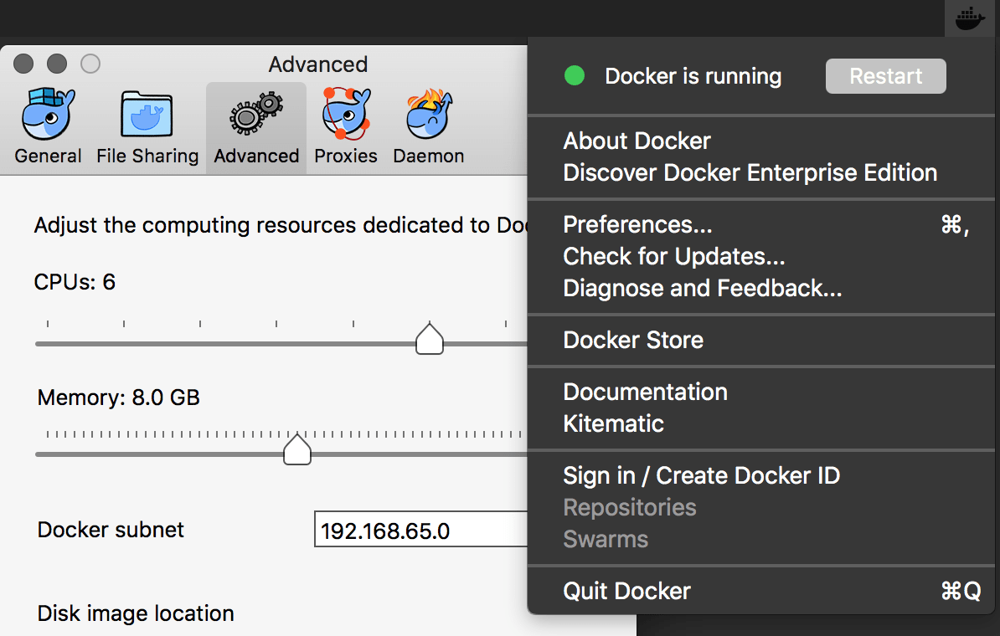

# Docker & Kubernetes 101

{{ URL }}

---

# Docker

> Docker is a tool designed to make it easier to create, deploy, and run
> applications by using containers. Containers allow a developer to package up
> an application with all of the parts it needs, such as libraries and other
> dependencies, and ship it all out as one package. — OpenSource.com, What is
> Docker?

---

# Infrastructure

Don't worry about the system your application will ultimately run on.

---

# Install Docker

Install at Docker's [getting-started](https://www.docker.com/get-started)

---

# Setup Docker

First, ensure you are using an up-to-date docker engine.
In the terminal,

1. Run `docker info` and check for any errors
1. Run `docker --version` and ensure you have version >=17.06

---

# Setup Docker Resources

Ensure you have set enough resources for Docker to run smoothly:
In the taskbar, click the whale icon → Preferences → Advanced

(I set 6 CPUs and 8GB RAM for Docker)

---

## Settings

---
