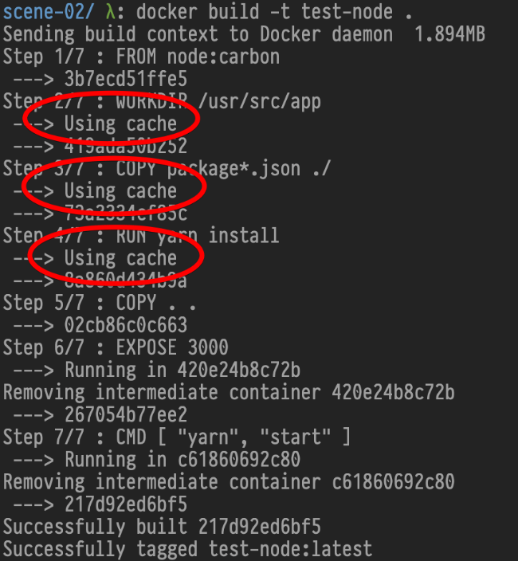

## My First Containerized Node Application

I recommend [Dockerfile documentation](https://docs.docker.com/engine/reference/builder/).
It's very well written.

---

## Dockerfile

Node service:

```Dockerfile
# creates a layer from the node:carbon Docker image
FROM node:8.14-alpine

# create the app directory for inside the Docker image
WORKDIR /usr/src/app

# copy and install app dependencies from the package.json (and the package-lock.json) into the root of the directory created above
COPY package*.json ./
RUN yarn install

# bundle app source inside Docker image
COPY . .

# expose port 8080 to have it mapped by Docker daemon
EXPOSE 3000

# define the command to run the app
CMD [ "yarn", "run", "start" ]
```

---

## app.js

```javascript
var express = require('express');
var app = express();

process.on('SIGINT', function () {
  process.exit();
});

app.get('/', function (req, res) {
  res.send("Hello World!\n");
});

app.listen(3000, function () {
  console.log('Example app listening on port 3000!');
});
```

---

## package.json

```json
{
  "name": "docker-101-scene-02",
  "version": "1.0.0",
  "main": "index.js",
  "author": "Rafael Bodill",
  "license": "MIT",
  "scripts": {
    "start": "node app.js"
  },
  "dependencies": {
    "express": "^4.16.4"
  }
}
```

---

## Let's Build & Run

```bash
docker build -t test-node .
docker run -it --rm test-node
```

On a new terminal:

```bash
curl localhost:3000
```

Where's my service? :(

---

## Expose Ports to Host

```bash
docker run -it --rm -p 3000:3000 test-node
```

On a new terminal:

```bash
curl localhost:3000
```

Hooray!

---

## Let's Add a Route

Append to `app.js`:

```javascript
app.get('/healthz', function (req, res) { res.send('OK') })
```

Rebuild image:

```bash
docker build -t test-node .
docker run -it --rm test-node
```

---

## Docker Layer Caching



---

## Docker Layers

```bash
$ docker history test-node

IMAGE               CREATED          SIZE      CREATED BY
d17562ebd02e        27 minutes ago   0B        CMD ["yarn" "start"]
c24c2a8c7a2a        27 minutes ago   0B        EXPOSE 3000
001439668f54        27 minutes ago   1.78MB    COPY dir:0dc6500de44402cb2…
24e151c2462b        27 minutes ago   7.13MB    yarn install
9dd639668f68        27 minutes ago   226B      COPY file:b365e33dfa656564…
a93bcafb8a76        27 minutes ago   0B        WORKDIR /usr/src/app
```

.. Wait ..  Our `app.js` is 1.78MB?

---

## Ignoring Files

Create a `.dockerignore` file with:

```txt
.git
.dockerignore
*.md
*.png
Dockerfile
node_modules
```

Rebuild image:

```bash
docker build -t test-node .
docker history test-node
```

Now it's better.

---


---
