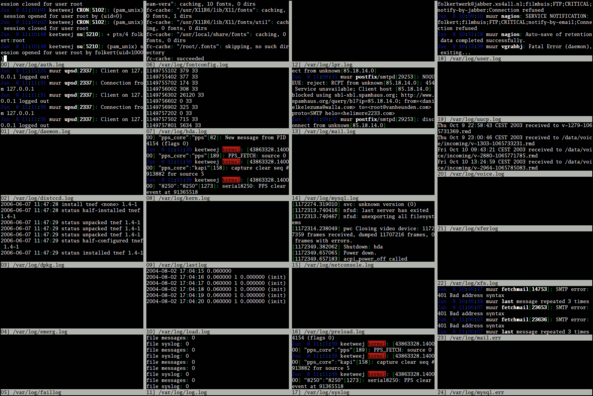

## Let's Fix Something

What's the most annoying thing when using many terminal windows/tabs?



---

## Shell History

Remember '`shopt -s histappend`' from our `~/.bashrc` ?

This causes shell to append each session's history to $HISTFILE,
and not overwrite it.

Great!

But I want it now.™

---

## Use the PROMPT_COMMAND!

Preserve bash history in multiple terminal windows:

Insert lines in `~/.bashrc` **BEFORE** `$XDG_CONFIG_HOME/bash/utils` sourcing:

```bash
# Append to history and re-read new history lines immediately
PROMPT_COMMAND="history -a; history -n; ${PROMPT_COMMAND}"
```

Want only to immediately append?

```bash
# Append to history immediately, but don't re-read history
PROMPT_COMMAND="history -a; ${PROMPT_COMMAND}"
```

Now open a few terminals, and test it!

---


---
