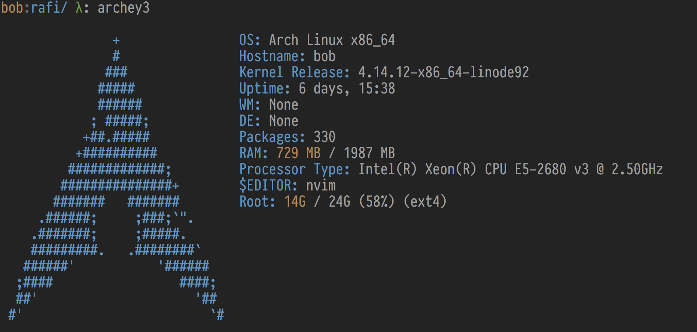

# Archey3

System information in the terminal.

## Installation

| OS        |                       |
|-----------|-----------------------|
| Archlinux | `pacman -S archey3`   |
| macOS     | `brew install archey` |

## Screenshot



## Configuration

Create a config file at `~/.config/archey3/config`:
```
[core]
display_modules = distro(), uname(n), uname(r), uptime(), wm(), packages(), ram(), cpu(), env(editor), fs(/), mpd(albums)
align = center
color = magenta
# Options: blue, black, red, green, yellow, magenta, cyan and white

[wm]
manual = i3

[de]
manual = None
```

And an alias:
```sh
alias archey3='archey3 --config="$XDG_CONFIG_HOME/archey3/config"'
```

Now run `archey3`
